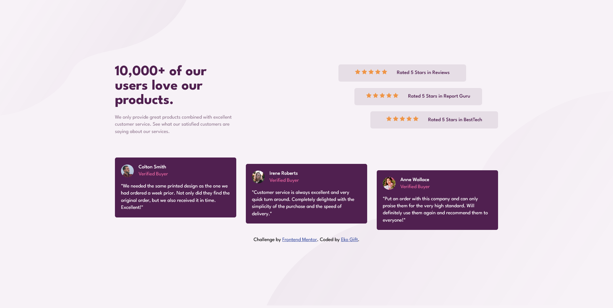

# Frontend Mentor - Social proof section solution

This is a solution to the [Social proof section challenge on Frontend Mentor](https://www.frontendmentor.io/challenges/social-proof-section-6e0qTv_bA). Frontend Mentor challenges help you improve your coding skills by building realistic projects. 

## Table of contents

- [Overview](#overview)
  - [The challenge](#the-challenge)
  - [Screenshot](#screenshot)
  - [Links](#links)
- [My process](#my-process)
  - [Built with](#built-with)
  - [What I learned](#what-i-learned)
- [Author](#author)

## Overview

Users should be able to:

- View the optimal layout for the section depending on their device's screen size

### Screenshot



### Links

- Solution URL: [https://github.com/Eko-U/social_proof](https://github.com/Eko-U/social_proof)
- Live Site URL: [https://eko-u.github.io/social_proof/](https://eko-u.github.io/social_proof/)

### Built with

- Semantic HTML5 markup
- CSS custom properties
- CSS Flexbox
- CSS Grid

### What I learned
I have been able to reinforce my knowledge on Flexbox, CSS Grid and able to use the media query in html to change different images at the given width. Code below: 👇
```html
<picture class="bk-bottom">
  <source 
    srcset="./images/bg-pattern-bottom-mobile.svg" 
    media="(max-width: 37.5em)">
    
</picture>
``` 

## Author

- Frontend Mentor - [@Eko-U](https://www.frontendmentor.io/profile/Eko-U)
- Twitter - [@eko_gift](https://www.twitter.com/eko_gift)